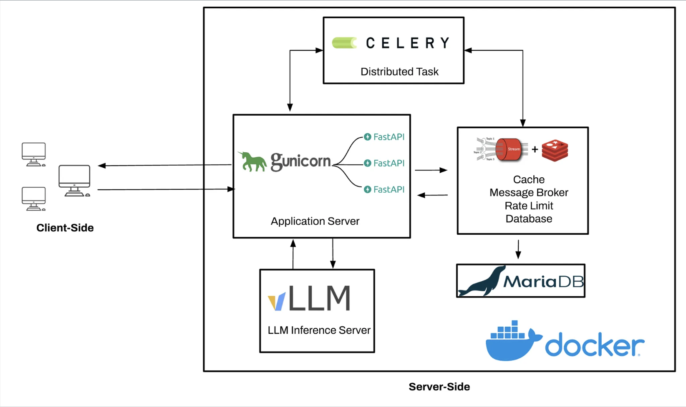

# OpenChat Backend

OpenChat is a modular, containerized backend system designed for chat and inference applications. It supports both cloud-based and local large language model (LLM) inference, robust background processing, caching, and persistent storage. The architecture is built for scalability and ease of deployment using Docker and Kubernetes.

## Overview

- **API Backend:** FastAPI-based service providing endpoints for chat and inference, supporting both streaming and standard responses.
- **LLM Inference:** Integrates with OpenAI APIs and supports local inference using vllm and HuggingFace Transformers.
- **Task Queueing:** Utilizes Celery for background task processing, with Redis as the message broker and backend.
- **Caching & Rate Limiting:** Employs Redis for caching chat responses and enforcing rate limits.
- **Database Integration:** Supports MySQL for persistent storage of chat history and task results.
- **Containerization & Orchestration:** Includes Dockerfiles for each component and Kubernetes manifests for deployment.
- **Monitoring:** Integrates with Flower for monitoring Celery tasks.
- **Extensibility:** Modular structure allows for easy addition of new tasks, models, or services.

## Main Components

- **app/**: FastAPI application exposing chat and inference APIs.
- **inference/**: Local LLM inference engine using vllm and Transformers.
- **task_queue/**: Celery-based background task processing.
- **database/**: Database initialization scripts and configuration.
- **message_queue/**: Redis and Sentinel configuration for message brokering.
- **common/**: Shared utilities and requirements.

## Technologies Used

- FastAPI
- Celery
- Redis
- MySQL
- Docker & Docker Compose
- Kubernetes
- vllm, HuggingFace Transformers
- OpenAI API

## High-Level Architecture

## Getting Started

- Review the provided Dockerfiles and Kubernetes manifests for deployment instructions.
- Configure environment variables as needed for API keys, database, and Redis connections.

## Directory Structure

- `app/` - Main API service
- `inference/` - LLM inference engine
- `task_queue/` - Background task processing
- `database/` - Database setup scripts
- `message_queue/` - Redis/Sentinel configs
- `common/` - Shared code and requirements

## License

This project is licensed under the [Creative Commons Attribution-NonCommercial-NoDerivatives 4.0 International (CC BY-NC-ND 4.0)](https://creativecommons.org/licenses/by-nc-nd/4.0/).